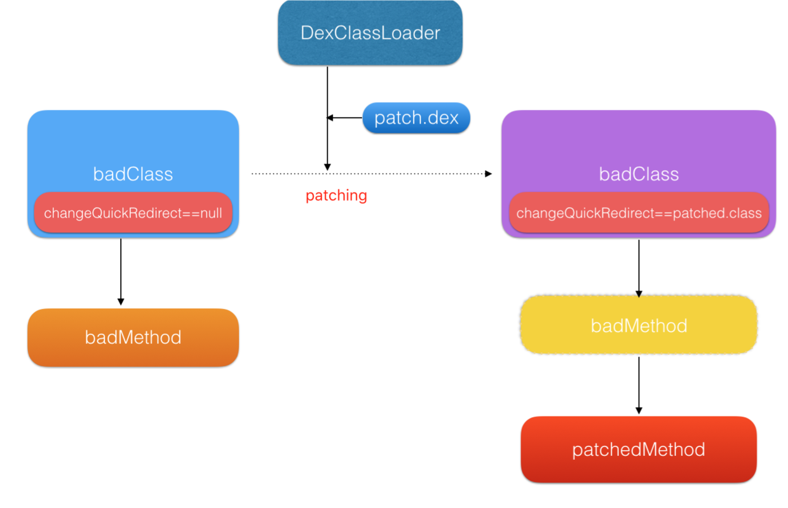

[toc]

#基于MultiDex


##Qzone（QQ空间）

检测规则
~~com.tencent.component.utils.injector~~
com.tencent.component.utils.injector.ClassLoaderInjector  检测成功

###DEX修复原理

在DexPathList的findClass中可以看出当多个dex中含有重复的类时，会找到靠前的dex中的类
```java
@/libcore/dalvik/src/main/java/dalvik/system/DexPathList.java

public Class<?> findClass(String name, List<Throwable> suppressed) {
    for (Element element : dexElements) {
        Class<?> clazz = element.findClass(name, definingContext, suppressed);
        if (clazz != null) {
            return clazz;
        }
    }

    if (dexElementsSuppressedExceptions != null) {
        suppressed.addAll(Arrays.asList(dexElementsSuppressedExceptions));
    }
    return null;
}
```

一个ClassLoader可以包含多个dex文件，每个dex文件是一个Element，多个dex文件排列成一个有序的数组dexElements，当找类的时候，会按顺序遍历dex文件，然后从当前遍历的dex文件中找类，如果找类则返回，如果找不到从下一个dex文件继续查找。理论上，如果在不同的dex中有相同的类存在，那么会优先选择排在前面的dex文件的类


1. 通过反射获取PathClassLoader中的DexPathList中的Element数组（已加载了第一个dex包，由系统加载）
2. 通过反射获取DexClassLoader中的DexPathList中的Element数组（将第二个dex包加载进去）
3. 将两个Element数组合并之后，再将其赋值给PathClassLoader的Element数组

方法中直接引用到的类（第一层级关系，不会进行递归搜索）和class都在同一个dex中的话，那么这个类就会被打CLASS_ISPREVERIFIED标志

```c++
@/dalvik/vm/analysis/DexPrepare.cpp

static void verifyAndOptimizeClass(DexFile* pDexFile, ClassObject* clazz,
    const DexClassDef* pClassDef, bool doVerify, bool doOpt)
{
    ... ...
    if (doVerify) {
        if (dvmVerifyClass(clazz)) {
            assert((clazz->accessFlags & JAVA_FLAGS_MASK) ==
                pClassDef->accessFlags);
            ((DexClassDef*)pClassDef)->accessFlags |= CLASS_ISPREVERIFIED;
            verified = true;
        } else {
            LOGV("DexOpt: '%s' failed verification", classDescriptor);
        }
    }
    ... ...
}
```

在加载类的时候会校验CLASS_ISPREVERIFIED标志
```c++
@/dalvik/vm/oo/Resolve.cpp

ClassObject* dvmResolveClass(const ClassObject* referrer, u4 classIdx,
    bool fromUnverifiedConstant)
{
    DvmDex* pDvmDex = referrer->pDvmDex;
    ClassObject* resClass;
    const char* className;

    resClass = dvmDexGetResolvedClass(pDvmDex, classIdx);
    if (resClass != NULL)
        return resClass;

    LOGVV("--- resolving class %u (referrer=%s cl=%p)",
        classIdx, referrer->descriptor, referrer->classLoader);

    className = dexStringByTypeIdx(pDvmDex->pDexFile, classIdx);
    if (className[0] != '\0' && className[1] == '\0') {
        resClass = dvmFindPrimitiveClass(className[0]);
    } else {
        resClass = dvmFindClassNoInit(className, referrer->classLoader);
    }

    if (resClass != NULL) {
        if (!fromUnverifiedConstant &&
            IS_CLASS_FLAG_SET(referrer, CLASS_ISPREVERIFIED))
        {
            ClassObject* resClassCheck = resClass;
            if (dvmIsArrayClass(resClassCheck))
                resClassCheck = resClassCheck->elementClass;

            /*
             *在这里发现dex不是同一个就抛异常了
             */
            if (referrer->pDvmDex != resClassCheck->pDvmDex &&
                resClassCheck->classLoader != NULL)
            {
                LOGW("Class resolved by unexpected DEX:"
                     " %s(%p):%p ref [%s] %s(%p):%p",
                    referrer->descriptor, referrer->classLoader,
                    referrer->pDvmDex,
                    resClass->descriptor, resClassCheck->descriptor,
                    resClassCheck->classLoader, resClassCheck->pDvmDex);
                LOGW("(%s had used a different %s during pre-verification)",
                    referrer->descriptor, resClass->descriptor);
                dvmThrowIllegalAccessError(
                    "Class ref in pre-verified class resolved to unexpected "
                    "implementation");
                return NULL;
            }
        }

        LOGVV("### +ResolveClass(%s): referrer=%s dex=%p ldr=%p ref=%d",
            resClass->descriptor, referrer->descriptor, referrer->pDvmDex,
            referrer->classLoader, classIdx);

        dvmDexSetResolvedClass(pDvmDex, classIdx, resClass);
    } else {
        LOGVV("Class not found: %s",
            dexStringByTypeIdx(pDvmDex->pDexFile, classIdx));
        assert(dvmCheckException(dvmThreadSelf()));
    }

    return resClass;
}
```

为了防止类被打上CLASS_ISPREVERIFIED标志，会往所有类的构造函数里面插入了一段代码

```java
if (ClassVerifier.PREVENT_VERIFY) {
    System.out.println(AntilazyLoad.class);
}
```

其中AntilazyLoad类会被打包成单独的hack.dex，这样当安装apk的时候，classes.dex内的类都会引用一个在不相同dex中的AntilazyLoad类，这样就防止了类被打上CLASS_ISPREVERIFIED的标志了，只要没被打上这个标志的类都可以进行打补丁操作。

*缺点：插桩的解决方案会影响到运行时性能，app内的所有类都预埋引用一个独立dex的空类，导致安装dexopt阶段的preverify失败，运行时将再次verify+optimize*

##QFix（手机QQ）

检测规则
com.tencent.mobileqq.qfix
com.tencent.mobileqq.qfix.QFixApplication


###DEX修复原理

与Qzone热修复方案相似，只是处理CLASS_ISPREVERIFIED有所差别

Qzone的实现方法是直接在jni中直接调用dvmResolveClass函数

```c++
ClassObject* dvmResolveClass(const ClassObject* referrer, u4 classIdx,
    bool fromUnverifiedConstant);
```

引用类referrer：必须跟需要patch的类在同一个dex，但是他们两个类不需要任何引用关系，任何一个在同一个dex中的类作为referrer都可以（reffer类必须提前加载）
补丁类的classIdx：补丁类在原dex文件结构类区中的索引id
fromUnverifiedConstant：必须为true，不验证是否为同一个dex

其中通过dvmFindLoadedClass函数获取referrer
```c++
@/dalvik/vm/oo/Class.cpp

ClassObject* dvmFindLoadedClass(const char* descriptor)
{
    int result;

    dvmHashTableLock(gDvm.loadedClasses);
    result = dvmHashForeach(gDvm.loadedClasses, findClassCallback,
            (void*) descriptor);
    dvmHashTableUnlock(gDvm.loadedClasses);

    return (ClassObject*) result;
}
```
这个方法只用传入类的描述符即可。对于主dex，直接用XXXApplication类就行，对于其它分dex，QFix的分dex方案有这样的逻辑：每当一个分dex完成注入，QFix都会尝试加载该dex里的一个固定空类来验证分dex是否注入成功了，所以这个固定的空类可以作为补丁的引用类使用

*局限性：由于是在dexopt后加载的补丁类，不能新增virtual方法，以免打乱虚表顺序*

##Nuwa（个人）
github: https://github.com/jasonross/Nuwa

检测规则
~~cn.jiajixin.nuwa~~
cn.jiajixin.nuwa.Nuwa  检测成功

#基于JNI替换


##Dexposed（淘宝）
github: https://github.com/alibaba/dexposed

检测规则
~~com.taobao.android.dexposed~~
com.taobao.android.dexposed.XposedHelpers  检测成功

##Andfix（阿里）
github: https://github.com/alibaba/AndFix

检测规则
com.alipay.euler.andfix  检测成功
~~com.alipay.euler.andfix.AndFixManager  检测失败~~

##Sophix（阿里）
使用方法： https://help.aliyun.com/document_detail/53240.html

检测规则
com.taobao.sophix
com.taobao.sophix.SophixManager

方案对比|Andfix开源版本|阿里Hotfix 1.X|阿里Hotfix最新版(Sophix)
-|-|-|-
方法替换|支持，除部分情况[0]|支持，除部分情况|全部支持方法调用时的权限检查
方法增加减少|不支持|不支持|以冷启动方式支持[1]Markdown Preview Enhanced
方法反射调用|只支持静态方法|只支持静态方法|以冷启动方式支持
即时生效|支持|支持|视情况支持[2]
多DEX|不支持|支持|支持
资源更新|不支持|不支持|支持
so库更新|不支持|不支持|支持
Android版本|支持2.3~7.0|支持2.3~6.0|全部支持包含7.0以上
已有机型|大部分支持[3]|大部分支持|全部支持
安全机制|无|加密传输及签名校验|加密传输及签名校验
性能损耗|低，几乎无损耗|低，几乎无损耗|低，仅冷启动情况下有些损耗
生成补丁|繁琐，命令行操作|繁琐，命令行操作|便捷，图形化界面
补丁大小|不大，仅变动的类|小，仅变动的方法|不大，仅变动的资源和代码[4]
服务端支持|无|支持服务端控制[5]|支持服务端控制

说明：
[0] 部分情况指的是构造方法、参数数目大于8或者参数包括long,double,float基本类型的方法。
[1] 冷启动方式，指的是需要重启app在下次启动时才能生效。
[2] 对于Andfix及Hotfix 1.X能够支持的代码变动情况，都能做到即时生效。而对于Andfix及Hotfix 1.X不支持的代码变动情况，会走冷启动方式，此时就无法做到即时生效。
[3] Hotfix 1.X已经支持绝大部分主流手机，只是在X86设备以及修改了虚拟机底层结构的ROM上不支持。
[4] 由于支持了资源和库，如果有这些方面的更新，就会导致的补丁变大一些，这个是很正常的。并且由于只包含差异的部分，所以补丁已经是最大程度的小了。
[5] 提供服务端的补丁发布和停发、版本控制和灰度功能，存储开发者上传的补丁包。

###DEX修复原理

####立即生效方式

以Android 6.0，art虚拟机中ArtMethod修复为例：

```c++
@art/runtime/art_method.h

class ArtMethod FINAL {
 ... ...

 protected:
  // Field order required by test "ValidateFieldOrderOfJavaCppUnionClasses".
  // The class we are a part of.
  GcRoot<mirror::Class> declaring_class_;

  // Short cuts to declaring_class_->dex_cache_ member for fast compiled code access.
  GcRoot<mirror::PointerArray> dex_cache_resolved_methods_;

  // Short cuts to declaring_class_->dex_cache_ member for fast compiled code access.
  GcRoot<mirror::ObjectArray<mirror::Class>> dex_cache_resolved_types_;

  // Access flags; low 16 bits are defined by spec.
  uint32_t access_flags_;

  / Dex file fields. The defining dex file is available via declaring_class_->dex_cache_ /

  // Offset to the CodeItem.
  uint32_t dex_code_item_offset_;

  // Index into method_ids of the dex file associated with this method.
  uint32_t dex_method_index_;

  / End of dex file fields. /

  // Entry within a dispatch table for this method. For static/direct methods the index is into
  // the declaringClass.directMethods, for virtual methods the vtable and for interface methods the
  // ifTable.
  uint32_t method_index_;

  // Fake padding field gets inserted here.

  // Must be the last fields in the method.
  // PACKED(4) is necessary for the correctness of
  // RoundUp(OFFSETOF_MEMBER(ArtMethod, ptr_sized_fields_), pointer_size).
  struct PACKED(4) PtrSizedFields {
    // Method dispatch from the interpreter invokes this pointer which may cause a bridge into
    // compiled code.
    void* entry_point_from_interpreter_;

    // Pointer to JNI function registered to this method, or a function to resolve the JNI function.
    void* entry_point_from_jni_;

    // Method dispatch from quick compiled code invokes this pointer which may cause bridging into
    // the interpreter.
    void* entry_point_from_quick_compiled_code_;
  } ptr_sized_fields_;

  ... ...
}
```

AndFix修复方案
```c++
smeth->declaring_class_ = dmeth->declaring_class_;
smeth->dex_cache_resolved_methods_ = dmeth->dex_cache_resolved_methods_;
smeth->dex_cache_resolved_types_ = dmeth->dex_cache_resolved_types_;
smeth->access_flags_ = dmeth->access_flags_;
smeth->dex_code_item_offset_ = dmeth->dex_code_item_offset_;
smeth->dex_method_index_ = dmeth->dex_method_index_;
smeth->method_index_ = dmeth->method_index_;
... ...
```


对不不同的安卓系统上，Dalvik和Art中的Method结构体存在差异，AndFix的解决方案就是针对每一个系统版本的Method结构进行替换。但是由于安卓代码是开源的，不同厂商可能对Method结构题进行调整，这个时候就需要寻找不依赖于ROM实现的方式来进行替换。

Sophix修复方案
```c++
memcpy(smeth, dmeth, sizeof(ArtMethod));
```


其中，sizeof(ArtMethod)可以通过direct ArtMethod Array中相邻两个ArtMethod获取。如
```java
public class NativeStructsModel {
    final public static void f1() {}
    final public static void f2() {}
}
```

f1和f2是相邻的，在jni中获取两个方法的差值即为ArtMethod的大小
```c++
size_t firMid = (size_t) env->GetStaticMethodID(nativeStructsModelClazz, "f1", "()V");
size_t secMid = (size_t) env->GetStaticMethodID(nativeStructsModelClazz, "f2", "()V");
size_t methSize = secMid - firMid;
```

*局限性：只能支持方法的替换。方法增加和减少以及成员字段的增加和减少无法通过该方式进行修复*

####冷启动生效方式


只要把补丁dex命名为classes.dex，原apk中的dex依次命名为classes(2,3,4...).dex，然后一起打包为一个压缩文件。然后DexFile.loadDex得到DexFile对象，最后把该DexFile对象整个替换旧的dexElement数组就可以了

对于art模式这么做就已经完成了，对于dalvik模式，要解决CLASS_ISPREVERIFIED问题

Sophix的做法是在旧dex中移除补丁class的定义，从而避免了CLASS_ISPREVERIFIED标记


```c++
@/dalvik/vm/analysis/DexPrepare.cpp

static void verifyAndOptimizeClasses(DexFile* pDexFile, bool doVerify,
    bool doOpt)
{
    u4 count = pDexFile->pHeader->classDefsSize;
    u4 idx;

    for (idx = 0; idx < count; idx++) {
        const DexClassDef* pClassDef;
        const char* classDescriptor;
        ClassObject* clazz;

        pClassDef = dexGetClassDef(pDexFile, idx);
        classDescriptor = dexStringByTypeIdx(pDexFile, pClassDef->classIdx);

        /* all classes are loaded into the bootstrap class loader */
        clazz = dvmLookupClass(classDescriptor, NULL, false);
        if (clazz != NULL) {
            verifyAndOptimizeClass(pDexFile, clazz, pClassDef, doVerify, doOpt);

        } else {
            // TODO: log when in verbose mode
            ALOGV("DexOpt: not optimizing unavailable class '%s'",
                classDescriptor);
        }
    }
}
```

针对Application所在的dex，出现CLASS_ISPREVERIFIED标志则会在jni中手动去除标志，将热修复初始化代码放在attachBaseContext最前面，一般就不会出什么问题

###资源修复原理

默认由Android SDK编出来的apk，是由aapt工具进行打包的，其资源包的package id就是0x7f。

如：
```
$ aapt d resources app-debug.apk

... ...
      spec resource 0x7f040019 com.taobao.patch.demo:layout/activity_main: flags=0x00000000
... ...
```

这就表示，activity_main.xml这个资源的编号是0x7f040019。它的package id是0x7f，资源类型的id为0x04，Type String Pool里的第四个字符串正是layout类型，而0x04类型的第0x0019个资源项就是activity_main这个资源

对资源进行patch时，对比新旧的不同，并将它们重新打成带有新package id的新资源包，默认把package id指定为0x66。然后，直接在原有的AssetManager中addAssetPath这个包就可以了

对于android4.4（sdk>20）以上时，直接调用AssetManager的addAssetPath加载资源即可

对于android4.4（sdk<=20）以上时，需要对AssetManager进行destroy然后重新init，调用addAssetPath添加加载过的资源路径和补丁资源路径，最后对mStringBlocks重新赋值即可

```java
    ... ...
    Method initMeth = assetManagerMethod("init");
    Method destroyMeth = assetManagerMethod("destroy");
    Method addAssetPathMeth = assetManagerMethod("addAssetPath", String.class);

    // 析构AssetManager
    destroyMeth.invoke(am);

    // 重新构造AssetManager
    initMeth.invoke(am);

    // 置空mStringBlocks
    assetManagerField("mStringBlocks").set(am, null);

    // 重新添加原有AssetManager中加载过的资源路径
    for (String path : loadedPaths) {
        LogTool.d(TAG, "pexyResources" + path);
        addAssetPathMeth.invoke(am, path);
    }

    // 添加patch资源路径
    addAssetPathMeth.invoke(am, patchPath);

    // 重新对mStringBlocks赋值
    assetManagerMethod("ensureStringBlocks").invoke(am);
}

private Method assetManagerMethod(String name, Class<?>... parameterTypes) {
   try {
       Method meth = Class.forName("android.content.res.AssetManager")
                        .getDeclaredMethod(name, parameterTypes);
       meth.setAccessible(true);
       return meth;
   } catch (Exception e) {
       LogTool.e(TAG, "assetManagerMethod", e);
       return null;
   }
}

private Field assetManagerField(String name) {
    try {
        Field field = mAssetManagerClass.getDeclaredField(name);
        field.setAccessible(true);
        return field;
    } catch (Exception e) {
        LogTool.e(TAG, "assetManagerField", e);
        return null;
    }
}

```

###so修复原理

调用System.loadLibrary时，会调用到ClassLoader.findLibrary搜索各个目录下是否存在指定so文件

```java
@/libcore/ojluni/src/main/java/java/lang/Runtime.java

synchronized void loadLibrary0(ClassLoader loader, String libname) {
    ... ...
    String libraryName = libname;
    if (loader != null) {
        String filename = loader.findLibrary(libraryName);
        if (filename == null) {
            throw new UnsatisfiedLinkError(loader + " couldn't find \"" +
                                           System.mapLibraryName(libraryName) + "\"");
        }
        String error = doLoad(filename, loader);
        if (error != null) {
            throw new UnsatisfiedLinkError(error);
        }
        return;
    }
    ... ...
}
```

对于Android 6.0以下（SDK < 23），findLibrary如下

```java
@/libcore/dalvik/src/main/java/dalvik/system/DexPathList.java

private final File[] nativeLibraryDirectories;

public String findLibrary(String libraryName) {
    String fileName = System.mapLibraryName(libraryName);

    for (File directory : nativeLibraryDirectories) {
        File file = new File(directory, fileName);
        if (file.exists() && file.isFile() && file.canRead()) {
            return file.getPath();
        }
    }

    return null;
}
```

可以采取类似类修复反射注入方式，只要把补丁so库的路径插入到nativeLibraryDirectories数组的最前面就能达到加载so库的时候是补丁so库而不是原来so库的目的，从而达到修复的目的

对于Android 6.0以上（SDK >= 23）

```java
@/libcore/dalvik/src/main/java/dalvik/system/DexPathList.java

private final Element[] nativeLibraryPathElements;
//private final NativeLibraryElement[] nativeLibraryPathElements; //Android 8.0

public String findLibrary(String libraryName) {
    String fileName = System.mapLibraryName(libraryName);

    for (NativeLibraryElement element : nativeLibraryPathElements) {
        String path = element.findNativeLibrary(fileName);

        if (path != null) {
            return path;
        }
    }

    return null;
}
```

只要针对sdk版本构造一个Element对象，然后再插入到nativeLibraryPathElements数组的最前面就好了

最后一个问题是在于如何选择abi
sdk >= 21时，直接反射拿到Application对象的primaryCpuAbi即可
sdk < 21时，由于此时不支持64位，所以直接把Build.CPU_ABI，Build.CPU_ABI2作为primaryCpuAbi即可

#基于instant app

##Tinker（腾讯）
github: https://github.com/Tencent/tinker

检测规则
com.tencent.tinker  检测成功
~~com.tencent.tinker.commons.dexpatcher.DexPatchApplier  检测失败~~


###DEX修复原理

Tinker是整体替换DEX的方案。主要的原理是与MutilDex技术基本相同，区别在于不再将patch.dex增加到elements数组中，而是差量的方式给出patch.dex，然后将patch.dex与应用的classes.dex合并，然后整体替换掉旧的DEX文件，以达到修复的目的。


1. 编译期通过自研算法DexDiff对新旧Dex生成patch.dex（优点：体积小）
2. 程序获得补丁后，将patch.dex重新跟原始安装包的旧Dex合并为新的fix_classes.dex（在后台进程操作，比较慢且占用内存较高）
3. 重启后将Element[]中的旧classes.dex替换为fix_classes.dex

*会不会有方法超过65535问题？*

###资源修复原理

将新的资源文件路径加到AssetManager中就可以了。在不同的configuration下，会对应不同的Resource对象，所以通过ResourceManager拿到所有的configuration对应的resource然后替换其assetManager。

```java
@tinker/tinker-android/tinker-android-loader/src/main/java/com/tencent/tinker/loader/TinkerResourcePatcher.java

// 反射拿到ActivityThread对象持有的LoadedApk容器
// 遍历容器中LoadedApk对象,反射替换mResDir属性为补丁物理路径
// 创建新的AssetManager, 并根据补丁路径反射调用addAssetPath将补丁加载到新的AssetManager中
// 反射获得ResourcesManager持有的Resources容器对象
public static void isResourceCanPatch(Context context) throws Throwable {
    //   - Replace mResDir to point to the external resource file instead of the .apk. This is
    //     used as the asset path for new Resources objects.
    //   - Set Application#mLoadedApk to the found LoadedApk instance

    // Find the ActivityThread instance for the current thread
    Class<?> activityThread = Class.forName("android.app.ActivityThread");
    currentActivityThread = ShareReflectUtil.getActivityThread(context, activityThread);

    // API version 8 has PackageInfo, 10 has LoadedApk. 9, I don't know.
    Class<?> loadedApkClass;
    try {
        loadedApkClass = Class.forName("android.app.LoadedApk");
    } catch (ClassNotFoundException e) {
        loadedApkClass = Class.forName("android.app.ActivityThread$PackageInfo");
    }


    resDir = loadedApkClass.getDeclaredField("mResDir");
    resDir.setAccessible(true);
    packagesFiled = activityThread.getDeclaredField("mPackages");
    packagesFiled.setAccessible(true);

    resourcePackagesFiled = activityThread.getDeclaredField("mResourcePackages");
    resourcePackagesFiled.setAccessible(true);

    // Create a new AssetManager instance and point it to the resources
    AssetManager assets = context.getAssets();
    // Baidu os
    if (assets.getClass().getName().equals("android.content.res.BaiduAssetManager")) {
        Class baiduAssetManager = Class.forName("android.content.res.BaiduAssetManager");
        newAssetManager = (AssetManager) baiduAssetManager.getConstructor().newInstance();
    } else {
        newAssetManager = AssetManager.class.getConstructor().newInstance();
    }

    addAssetPathMethod = AssetManager.class.getDeclaredMethod("addAssetPath", String.class);
    addAssetPathMethod.setAccessible(true);

    // Kitkat needs this method call, Lollipop doesn't. However, it doesn't seem to cause any harm
    // in L, so we do it unconditionally.
    ensureStringBlocksMethod = AssetManager.class.getDeclaredMethod("ensureStringBlocks");
    ensureStringBlocksMethod.setAccessible(true);

    // Iterate over all known Resources objects
    if (SDK_INT >= KITKAT) {
        //pre-N
        // Find the singleton instance of ResourcesManager
        Class<?> resourcesManagerClass = Class.forName("android.app.ResourcesManager");
        Method mGetInstance = resourcesManagerClass.getDeclaredMethod("getInstance");
        mGetInstance.setAccessible(true);
        Object resourcesManager = mGetInstance.invoke(null);
        try {
            Field fMActiveResources = resourcesManagerClass.getDeclaredField("mActiveResources");
            fMActiveResources.setAccessible(true);
            ArrayMap<?, WeakReference<Resources>> activeResources19 =
                (ArrayMap<?, WeakReference<Resources>>) fMActiveResources.get(resourcesManager);
            references = activeResources19.values();
        } catch (NoSuchFieldException ignore) {
            // N moved the resources to mResourceReferences
            Field mResourceReferences = resourcesManagerClass.getDeclaredField("mResourceReferences");
            mResourceReferences.setAccessible(true);
            references = (Collection<WeakReference<Resources>>) mResourceReferences.get(resourcesManager);
        }
    } else {
        Field fMActiveResources = activityThread.getDeclaredField("mActiveResources");
        fMActiveResources.setAccessible(true);
        HashMap<?, WeakReference<Resources>> activeResources7 =
            (HashMap<?, WeakReference<Resources>>) fMActiveResources.get(currentActivityThread);
        references = activeResources7.values();
    }
    // check resource
    if (references == null) {
        throw new IllegalStateException("resource references is null");
    }
    // fix jianGuo pro has private field 'mAssets' with Resource
    // try use mResourcesImpl first
    if (SDK_INT >= 24) {
        try {
            // N moved the mAssets inside an mResourcesImpl field
            resourcesImplFiled = Resources.class.getDeclaredField("mResourcesImpl");
            resourcesImplFiled.setAccessible(true);
        } catch (Throwable ignore) {
            // for safety
            assetsFiled = Resources.class.getDeclaredField("mAssets");
            assetsFiled.setAccessible(true);
        }
    } else {
        assetsFiled = Resources.class.getDeclaredField("mAssets");
        assetsFiled.setAccessible(true);
    }
//        final Resources resources = context.getResources();
//        isMiuiSystem = resources != null && MIUI_RESOURCE_CLASSNAME.equals(resources.getClass().getName());

    try {
        publicSourceDirField = ShareReflectUtil.findField(ApplicationInfo.class, "publicSourceDir");
    } catch (NoSuchFieldException ignore) {
    }
}
```

```java
@tinker/tinker-android/tinker-android-loader/src/main/java/com/tencent/tinker/loader/TinkerResourcePatcher.java

// 遍历出容器中的Resources对象, 替换对象的属性为新的AssetManager, 并且根据原属性重新更新Resources对象的配置
public static void monkeyPatchExistingResources(Context context, String externalResourceFile) throws Throwable {
    if (externalResourceFile == null) {
        return;
    }

    for (Field field : new Field[]{packagesFiled, resourcePackagesFiled}) {
        Object value = field.get(currentActivityThread);

        for (Map.Entry<String, WeakReference<?>> entry
            : ((Map<String, WeakReference<?>>) value).entrySet()) {
            Object loadedApk = entry.getValue().get();
            if (loadedApk == null) {
                continue;
            }
            if (externalResourceFile != null) {
                resDir.set(loadedApk, externalResourceFile);
            }
        }
    }

    // Create a new AssetManager instance and point it to the resources installed under
    if (((Integer) addAssetPathMethod.invoke(newAssetManager, externalResourceFile)) == 0) {
        throw new IllegalStateException("Could not create new AssetManager");
    }

    // Kitkat needs this method call, Lollipop doesn't. However, it doesn't seem to cause any harm
    // in L, so we do it unconditionally.
    ensureStringBlocksMethod.invoke(newAssetManager);

    for (WeakReference<Resources> wr : references) {
        Resources resources = wr.get();
        //pre-N
        if (resources != null) {
            // Set the AssetManager of the Resources instance to our brand new one
            try {
                assetsFiled.set(resources, newAssetManager);
            } catch (Throwable ignore) {
                // N
                Object resourceImpl = resourcesImplFiled.get(resources);
                // for Huawei HwResourcesImpl
                Field implAssets = ShareReflectUtil.findField(resourceImpl, "mAssets");
                implAssets.setAccessible(true);
                implAssets.set(resourceImpl, newAssetManager);
            }

            clearPreloadTypedArrayIssue(resources);

            resources.updateConfiguration(resources.getConfiguration(), resources.getDisplayMetrics());
        }
    }

    // Handle issues caused by WebView on Android N.
    // Issue: On Android N, if an activity contains a webview, when screen rotates
    // our resource patch may lost effects.
    // for 5.x/6.x, we found Couldn't expand RemoteView for StatusBarNotification Exception
    if (Build.VERSION.SDK_INT >= 24) {
        try {
            if (publicSourceDirField != null) {
                publicSourceDirField.set(context
                .getApplicationInfo(), externalResourceFile);
            }
        } catch (Throwable ignore) {
        }
    }

    if (!checkResUpdate(context)) {
        throw new TinkerRuntimeException(ShareConstants.CHECK_RES_INSTALL_FAIL);
    }
}

```

###so修复原理

修改nativeLibraryDirectories数组，将补丁so路径添加到数组最前面

```java
@tinker/tinker-android/tinker-android-lib/src/main/java/com/tencent/tinker/lib/library/TinkerLoadLibrary.java

private static void install(ClassLoader classLoader, File folder)  throws Throwable {
    Field pathListField = ShareReflectUtil.findField(classLoader, "pathList");
    Object dexPathList = pathListField.get(classLoader);

    Field nativeLibraryDirectories = ShareReflectUtil.findField(dexPathList, "nativeLibraryDirectories");

    List<File> libDirs = (List<File>) nativeLibraryDirectories.get(dexPathList);
    libDirs.add(0, folder);
    Field systemNativeLibraryDirectories =
            ShareReflectUtil.findField(dexPathList, "systemNativeLibraryDirectories");
    List<File> systemLibDirs = (List<File>) systemNativeLibraryDirectories.get(dexPathList);
    Method makePathElements =
            ShareReflectUtil.findMethod(dexPathList, "makePathElements", List.class);
    libDirs.addAll(systemLibDirs);
    Object[] elements = (Object[]) makePathElements.
            invoke(dexPathList, libDirs);
    Field nativeLibraryPathElements = ShareReflectUtil.findField(dexPathList, "nativeLibraryPathElements");
    nativeLibraryPathElements.setAccessible(true);
    nativeLibraryPathElements.set(dexPathList, elements);
}
```

##Robust（美团）
github: https://github.com/Meituan-Dianping/Robust

检测规则
~~com.meituan.robust~~
com.meituan.robust.assistant.PatchHelper  检测成功

###DEX修复原理



例如有一个getIndex函数
```java
public long getIndex() {
    return 100;
}
```

在编译打包的过程中转换成了如下的实现
```java
public static ChangeQuickRedirect changeQuickRedirect;
public long getIndex() {
    if(changeQuickRedirect != null) {
        //PatchProxy中封装了获取当前className和methodName的逻辑，并在其内部最终调用了changeQuickRedirect的对应函数
        if(PatchProxy.isSupport(new Object[0], this, changeQuickRedirect, false)) {
            return ((Long)PatchProxy.accessDispatch(new Object[0], this, changeQuickRedirect, false)).longValue();
        }
    }
    return 100L;
}
```

假设getIndex要返回106
```java
public long getIndex() {
    return 106;
}
```

生成的patch，主要包含两个class：PatchesInfoImpl.java和StatePatch.java
```java
@PatchesInfoImpl.java

public class PatchesInfoImpl implements PatchesInfo {
    public List<PatchedClassInfo> getPatchedClassesInfo() {
        List<PatchedClassInfo> patchedClassesInfos = new ArrayList<PatchedClassInfo>();
        PatchedClassInfo patchedClass = new PatchedClassInfo("com.meituan.sample.d", StatePatch.class.getCanonicalName());
        patchedClassesInfos.add(patchedClass);
        return patchedClassesInfos;
    }
}
```

```java
@StatePatch.java

public class StatePatch implements ChangeQuickRedirect {
    @Override
    public Object accessDispatch(String methodSignature, Object[] paramArrayOfObject) {
        String[] signature = methodSignature.split(":");
        if (TextUtils.equals(signature[1], "a")) {//long getIndex() -> a
            return 106;
        }
        return null;
    }

    @Override
    public boolean isSupport(String methodSignature, Object[] paramArrayOfObject) {
        String[] signature = methodSignature.split(":");
        if (TextUtils.equals(signature[1], "a")) {//long getIndex() -> a
            return true;
        }
        return false;
    }
}
```

获取到patch.dex文件后调用com.meituan.robust.PatchExecutor中的patch方法

1. 用DexClassLoader加载patch.dex
2. 反射拿到PatchesInfoImpl.java这个class，并创建PatchesInfoImpl的一个对象
3. 得到当前运行环境中的需要patch的class
4. 将其中的changeQuickRedirect字段赋值为PatchesInfoImpl对象

```java
@/Robust/patch/src/main/java/com/meituan/robust/PatchExecutor.java

protected boolean patch(Context context, Patch patch) {
    if (!patchManipulate.verifyPatch(context, patch)) {
        robustCallBack.logNotify("verifyPatch failure, patch info:" + "id = " + patch.getName() + ",md5 = com.meituan.robust" + patch.getMd5(), "class:PatchExecutor method:patch line:107");
        return false;
    }

    //用DexClassLoader加载patch.dex
    DexClassLoader classLoader = new DexClassLoader(patch.getTempPath(), context.getCacheDir().getAbsolutePath(),
            null, PatchExecutor.class.getClassLoader());
    patch.delete(patch.getTempPath());

    Class patchClass, oldClass;

    //反射得到PatchesInfoImpl对象
    Class patchsInfoClass;
    PatchesInfo patchesInfo = null;
    try {
        Log.d("robust", "PatchsInfoImpl name:" + patch.getPatchesInfoImplClassFullName());
        patchsInfoClass = classLoader.loadClass(patch.getPatchesInfoImplClassFullName());
        patchesInfo = (PatchesInfo) patchsInfoClass.newInstance();
        Log.d("robust", "PatchsInfoImpl ok");
    } catch (Throwable t) {
        robustCallBack.exceptionNotify(t, "class:PatchExecutor method:patch line:108");
        Log.e("robust", "PatchsInfoImpl failed,cause of" + t.toString());
        t.printStackTrace();
    }

    if (patchesInfo == null) {
        robustCallBack.logNotify("patchesInfo is null, patch info:" + "id = " + patch.getName() + ",md5 = " + patch.getMd5(), "class:PatchExecutor method:patch line:114");
        return false;
    }

    //得到当前运行环境中的需要patch的classdvmThrowIllegalAccessError
    //classes need to patch
    List<PatchedClassInfo> patchedClasseloadClasss = patchesInfo.getPatchedClassesInfo();
    if (null == patchedClasses || patchedClasses.isEmpty()) {
        robustCallBack.logNotify("patchedClasses is null or empty, patch info:" + "id = " + patch.getName() + ",md5 = " + patch.getMd5(), "class:PatchExecutor method:patch line:122");
        return false;
    }

    //将其中的changeQuickRedirect字段赋值为PatchesInfoImpl对象
    for (PatchedClassInfo patchedClassInfo : patchedClasses) {
        String patchedClassName = patchedClassInfo.patchedClassName;
        String patchClassName = patchedClassInfo.patchClassName;
        if (TextUtils.isEmpty(patchedClassName) || TextUtils.isEmpty(patchClassName)) {
            robustCallBack.logNotify("patchedClasses or patchClassName is empty, patch info:" + "id = " + patch.getName() + ",md5 = " + patch.getMd5(), "class:PatchExecutor method:patch line:131");
            continue;
        }
        Log.d("robust", "current path:" + patchedClassName);
        try {
            oldClass = classLoader.loadClass(patchedClassName.trim());
            Field[] fields = oldClass.getDeclaredFields();
            Log.d("robust", "oldClass :" + oldClass + "     fields " + fields.length);
            Field changeQuickRedirectField = null;
            for (Field field : fields) {
                if (TextUtils.equals(field.getType().getCanonicalName(), ChangeQuickRedirect.class.getCanonicalName()) && TextUtils.equals(field.getDeclaringClass().getCanonicalName(), oldClass.getCanonicalName())) {
                    changeQuickRedirectField = field;
                    break;
                }
            }
            if (changeQuickRedirectField == null) {
                robustCallBack.logNotify("changeQuickRedirectField  is null, patch info:" + "id = " + patch.getName() + ",md5 = " + patch.getMd5(), "class:PatchExecutor method:patch line:147");
                Log.d("robust", "current path:" + patchedClassName + " something wrong !! can  not find:ChangeQuickRedirect in" + patchClassName);
                continue;
            }
            Log.d("robust", "current path:" + patchedClassName + " find:ChangeQuickRedirect " + patchClassName);
            try {
                patchClass = classLoader.loadClass(patchClassName);
                Object patchObject = patchClass.newInstance();
                changeQuickRedirectField.setAccessible(true);
                changeQuickRedirectField.set(null, patchObject);
                Log.d("robust", "changeQuickRedirectField set sucess " + patchClassName);
            } catch (Throwable t) {
                Log.e("robust", "patch failed! ");
                t.printStackTrace();
                robustCallBack.exceptionNotify(t, "class:PatchExecutor method:patch line:163");
            }
        } catch (Throwable t) {Amigo
            Log.e("robust", "patch failed! ");
            t.printStackTrace();
            robustCallBack.exceptionNotify(t, "class:PatchExecutor method:patch line:169");
        }
    }
    Log.d("robust", "patch finished ");
    return true;
}
```

##Amigo（饿了么）
github: https://github.com/eleme/Amigo

检测规则
~~me.ele.amigo~~
me.ele.amigo.Amigo  检测成功

###DEX修复原理

在替换dex时，Amigo将补丁包中每个dex对应的Element对象拿出来，之后组成新的Element[]，通过反射，将现有的Element[]数组替换掉。

###资源修复原理

将新的资源文件路径加到AssetManager中就可以了。在不同的configuration下，会对应不同的Resource对象，所以通过ResourceManager拿到所有的configuration对应的resource然后替换其assetManager。

###so修复原理

把补丁so库的路径插入到nativeLibraryDirectories数组的最前面就能达到加载so库的时候是补丁so库而不是原来so库的目的，从而达到修复的目的

##RocooFix（个人）
github: https://github.com/dodola/RocooFix

检测规则
~~com.dodola.rocoofix~~
com.dodola.rocoofix.RocooFix  检测成功

#插件化

##RePlugin（360）
github: https://github.com/Qihoo360/RePlugin

##VirtualAPK（滴滴出行）
github: https://github.com/didi/VirtualAPK

##DynamicAPK（携程）
github: https://github.com/CtripMobile/DynamicAPK

##...

#参考文章
1. http://www.jianshu.com/p/eec0ab6800a4    Android热修复方案比较
2. https://yq.aliyun.com/articles/74598?spm=5176.doc53240.2.33.y4KlWO    Android热修复升级探索——追寻极致的代码热替换
3. http://blog.csdn.net/yubo_725/article/details/52385595    Android APK DEX分包总结
4. http://blog.csdn.net/hp910315/article/details/51681710    MultiDex与热修复实现原理
5. https://mp.weixin.qq.com/s?__biz=MzI1MTA1MzM2Nw==&mid=400118620&idx=1&sn=b4fdd5055731290eef12ad0d17f39d4a    安卓App热补丁动态修复技术介绍
6. http://dev.qq.com/topic/57ff5832bb8fec206ce2185d    QFix探索之路—手Q热补丁轻量级方案
7. http://blog.csdn.net/u011200604/article/details/60143582    Android 热修复原理篇及几大方案比较
7. https://github.com/eleme/Amigo/blob/bb42929382c0e14b2d5a2af68cbc24ea69c2cc3e/blog.md    Amigo 源码解读
7. http://blog.csdn.net/l2show/article/details/53187548    Android 热修复方案Tinker
8. https://yq.aliyun.com/attachment/download/?id=1855    《深入探索Android热修复技术原理.pdf》
